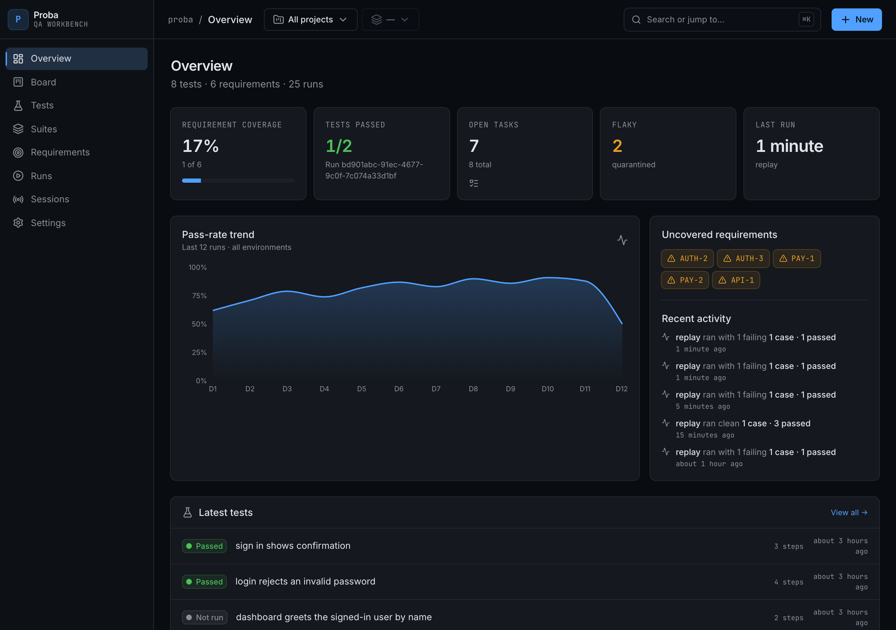
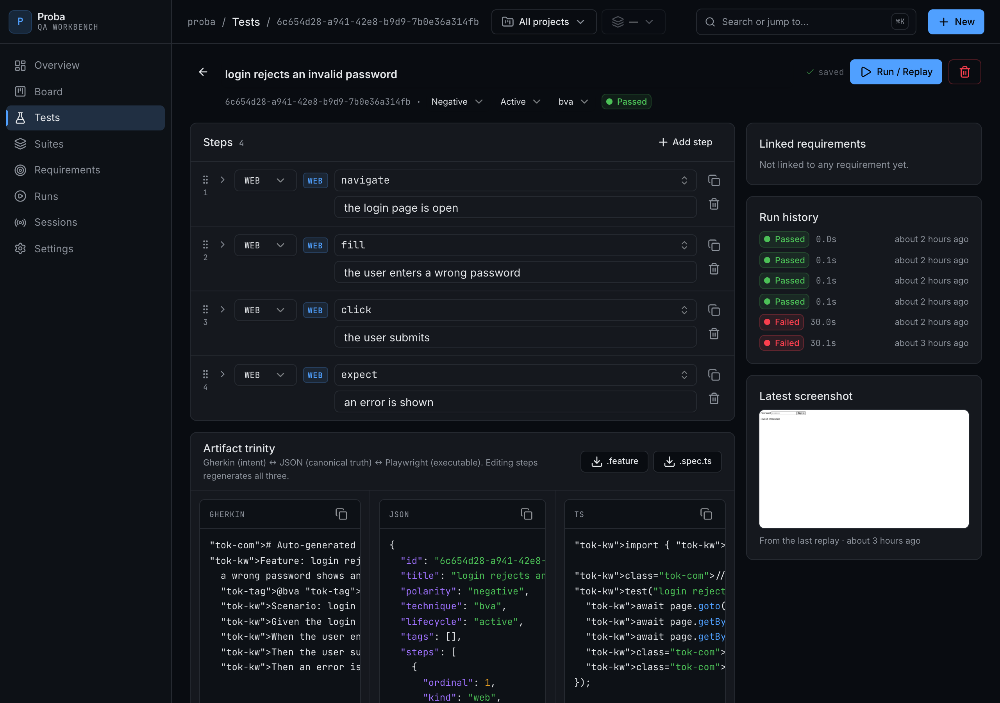
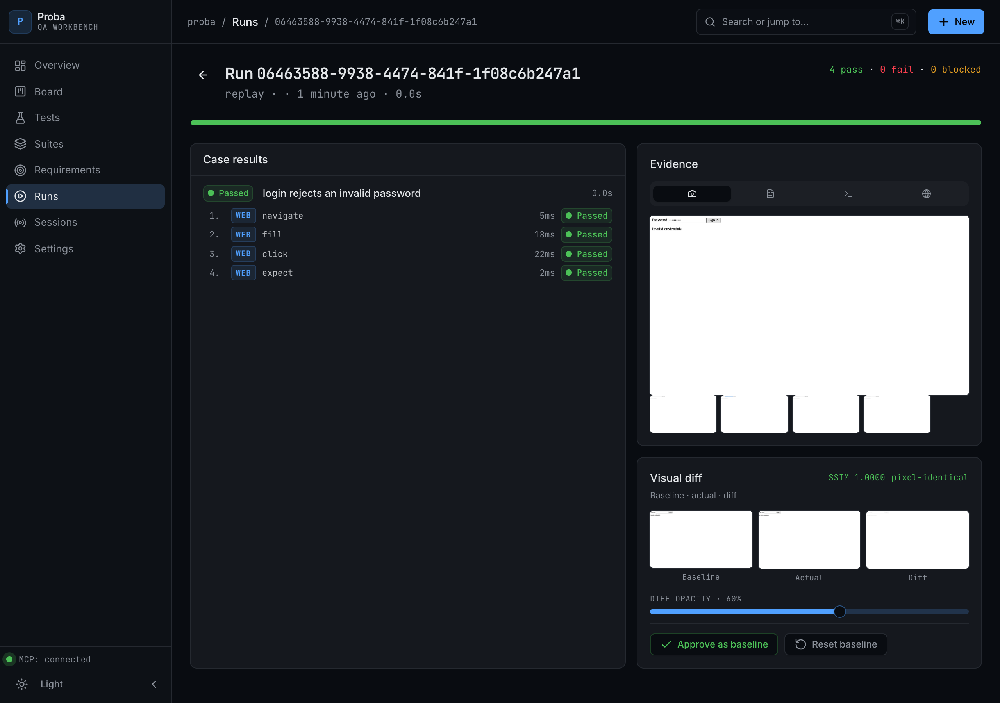
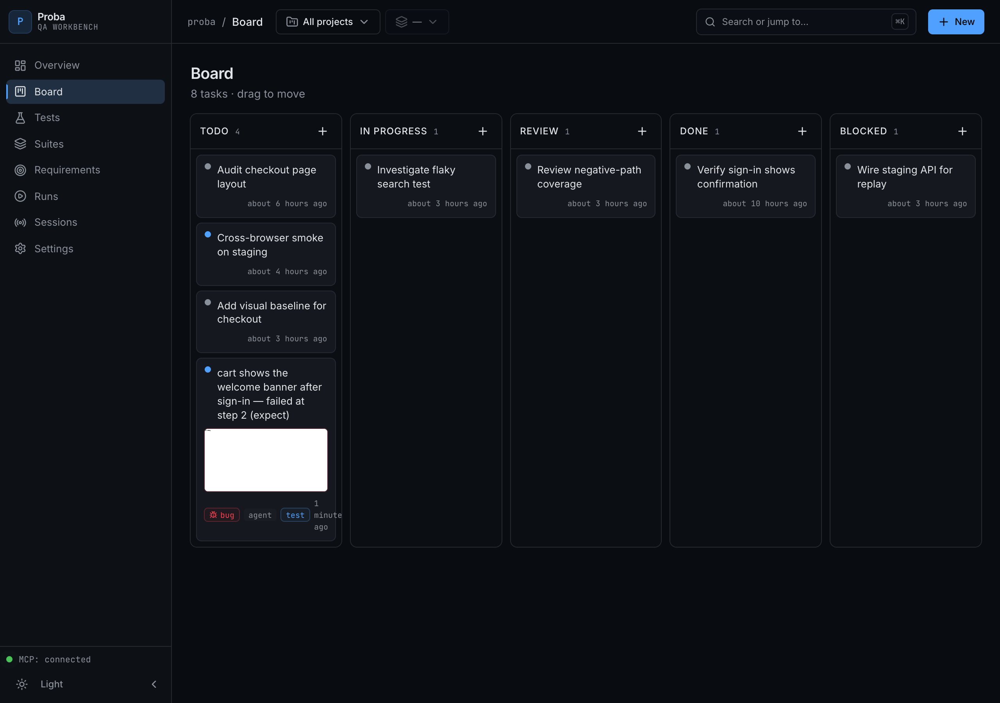
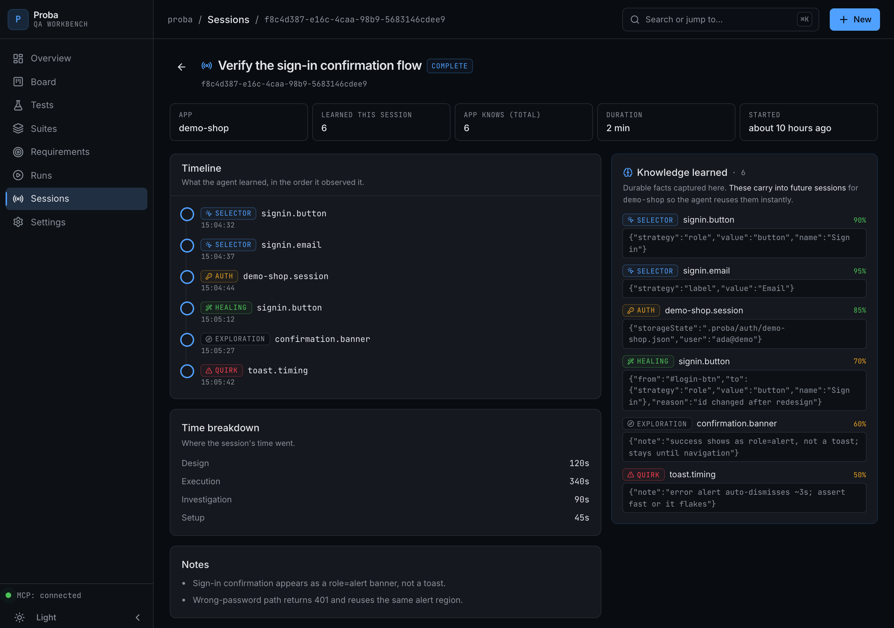

<div align="center">

# Proba

### The QA workbench for the agent era — drive a web app, API or database through MCP, and walk away with tests you actually own.

[](https://github.com/evotech-bg/proba/actions/workflows/ci.yml)
[](LICENSE)
[](https://nodejs.org)
[](#status)
[](#install-it-in-your-agent-mcp)
[](CONTRIBUTING.md)

Playwright's MCP server, reimagined for QA engineers: a dashboard, an embedded task board, owned
test artifacts, visual / layout / a11y checks, and cross-session memory so the agent gets smarter
every run. Runs fully local on SQLite — no cloud, no account, nothing leaves your machine.



</div>

> ### Opening it to the world 🌍
> We built Proba at **evotech-bg** as an internal QA workbench, to test our own products without
> drowning in throwaway, untrustworthy generated tests. It kept getting better, and at some point it
> stopped feeling like an internal tool and started feeling like something other builders would love
> too. So here it is, in the open, **MIT, free for everyone**. Same tool we use ourselves, no
> stripped-down "community edition." If it saves you the afternoons it saved us, it did its job.
> Pull requests, ideas, and war stories are all welcome.

## The problem

Letting an AI "write your tests" gives you a pile of selectors you did not author, cannot trust,
and will not maintain. The agent re-discovers the same app on every run, generates brittle
positional locators, and leaves you with code you have to reverse-engineer before you can change a
thing. Ownership and continuity are missing.

## The idea

Proba flips it around: **the agent drafts, you stay the owner.** Every action it takes through MCP
becomes a durable artifact in three synced views — and what it learns about your app is remembered
for next time.

```
  Gherkin  (.feature)      ↔      JSON canonical      ↔      Playwright  (.spec.ts)
  the intent, human-readable      the source of truth         the executable test
            └──────────── edit any one; it round-trips through the canonical form ───────────┘
```

## Why it is different

|                                   | Proba | Raw Playwright-MCP | "AI writes my tests" |
| --------------------------------- | :---: | :----------------: | :------------------: |
| Editable, owned artifacts         |  ✅   |         ❌         |     ⚠️ (raw code)    |
| Memory across sessions            |  ✅   |  ⚠️ (auth only)    |          ❌          |
| Stable locators enforced          |  ✅   |         ❌         |          ❌          |
| Web + API + DB on one spine       |  ✅   |    ❌ (web only)   |          ❌          |
| Visual / layout / a11y built in   |  ✅   |         ❌         |          ❌          |
| Failures become tracked bug tickets | ✅  |         ❌         |          ❌          |
| Dashboard you can drive by hand   |  ✅   |         ❌         |          ❌          |

The highlights:

- **Owned, editable artifacts.** One test, three synced views (Gherkin ↔ JSON ↔ Playwright TS).
  Edit any in the UI; it round-trips. The AI drafts, you sign off.
- **Durable agent memory — the moat.** Discovered selectors, app quirks, auth state, exploration
  notes and self-healing decisions persist across sessions. The agent resumes instead of
  re-exploring. This is the gap today's tools leave open.
- **Log in once, reuse everywhere.** Capture a session's auth with `proba_save_auth`; replays and
  new sessions for that app start already authenticated (Playwright `storageState` is injected), so
  gated routes work without re-login steps in every test.
- **Stable locators by construction.** `getByRole` → text/label → `data-testid`; positional CSS
  and XPath are rejected at emit time, so tests do not rot on the next redesign.
- **Per-app accounts & variables.** Store named test accounts and variables once, reference them in
  any step as `{{account.client.email}}` or `{{var.baseURL}}` — resolved at run time. Credentials
  stay out of the test artifacts, and one flow runs against different accounts/roles.
- **Run a suite as a matrix.** Write a flow with the generic `{{account.email}}`/`{{account.password}}`,
  then run the suite once per selected account — each pass binds those to that account and injects its
  saved login, so you validate every role from one suite.
- **One spine, three step kinds.** web / API / DB, with cross-layer assertions (UI → API → DB).
- **Closes the loop — and heals.** A failed replay auto-files a board bug ticket (title, failing
  step, screenshot); the agent can `proba_diagnose` it (Proba surfaces candidate locators from the
  live page) and `proba_patch_step` to fix the test; a clean replay then auto-resolves the ticket.
  Re-runs refresh the one ticket instead of spamming duplicates.
- **Organised by project.** A two-level project → surface (web / mobile / admin) scope filters the
  whole workbench, so several apps never get mixed up.
- **Snapshot testing.** Two step assertions a programmer expects: `{ type: 'visual', name }`
  (screenshot the element/page, pixel + SSIM diff vs an auto-established baseline) and
  `{ type: 'snapshot', name }` (serialize the element's text/structure, flag drift). First run sets
  the baseline; later runs compare.
- **Visual + layout + a11y.** Pixel diff and SSIM perceptual diff against approved baselines,
  geometry asserts (overlap / truncation / alignment), and axe-core scans.

## See it

| Test editor (artifact trinity) | Run evidence + visual diff |
| --- | --- |
|  |  |

| Task board (auto-filed bug) | Session memory |
| --- | --- |
|  |  |

## Quickstart

Requires **Node 22+** and **pnpm 9+**.

```bash
git clone https://github.com/evotech-bg/proba.git
cd proba
pnpm install
pnpm dev          # dashboard on http://localhost:8080 — opens with the demo data
```

A curated demo store ships in the repo (`demo/proba.db`): two projects, web/API/DB tests, suites,
requirements with coverage, run history, recorded sessions with learned selectors, and an auto-filed
bug. On first `pnpm dev` it is copied to your local `.proba/proba.db` so you can click, edit and
replay immediately. Every demo test is self-contained (uses `data:` URLs), so hitting **Run /
Replay** works offline and produces real screenshots and visual diffs on the spot. Reset to the
pristine demo anytime with `pnpm seed`.

```bash
pnpm mcp          # start the MCP server (stdio) for an agent to drive
pnpm dashboard    # launch the dashboard from the CLI (also: the proba_open_dashboard MCP tool)
pnpm test         # run the whole test suite
pnpm typecheck    # all packages
```

## Install it in your agent (MCP)

Proba is an MCP server: install it once and any MCP-capable agent can drive QA through it. Every
config uses the same command — `pnpm --filter @proba/mcp start` — with `cwd` set to where you cloned
Proba. Replace `/absolute/path/to/proba` below.

> **Zero-config in this repo:** a project-scoped [`.mcp.json`](.mcp.json) ships with Proba, so if you
> open the cloned repo in **Claude Code** it auto-detects the `proba` server — just approve it. The
> manual configs below are for using Proba from *another* project or agent.

**Claude Code** (one line):

```bash
claude mcp add proba --cwd /absolute/path/to/proba -- pnpm --filter @proba/mcp start
```

**Cursor** — `~/.cursor/mcp.json` (or `.cursor/mcp.json` per project):

```json
{
  "mcpServers": {
    "proba": { "command": "pnpm", "args": ["--filter", "@proba/mcp", "start"], "cwd": "/absolute/path/to/proba" }
  }
}
```

**Windsurf** (`~/.codeium/windsurf/mcp_config.json`), **VS Code — Cline / Continue** (the
extension's MCP settings), and **Claude Desktop** (`claude_desktop_config.json`) all take the same
`mcpServers` block as Cursor.

> Tip: after `pnpm -r build`, you can point `command`/`args` at `node` +
> `packages/mcp/dist/index.js` if you would rather not depend on pnpm at runtime.

### A typical loop

1. `proba_project_create` / `proba_app_create` — scope the work to a project and surface.
2. `proba_session_open` — start/resume a session (returns what is already known, so you resume).
3. `proba_act` / `proba_request` — drive the web / API (locators are role/text/testid only).
4. `proba_finalize_test` — emit the Gherkin + JSON + Playwright artifacts.
5. `proba_open_dashboard` — open the dashboard to review, edit, and replay what was recorded.

### Tool surface

| Area | Tools |
| --- | --- |
| Projects & scope | `proba_project_list` · `proba_project_create` · `proba_app_create` |
| Accounts & config | `proba_account_set` · `proba_config_set` · `proba_config_list` · `proba_config_delete` |
| Sessions & memory | `proba_session_open` · `proba_remember` · `proba_save_auth` · `proba_snapshot` · `proba_close_session` |
| Recording | `proba_start_case` · `proba_act` · `proba_request` · `proba_finalize_test` · `proba_replay` · `proba_replay_suite` |
| Self-heal | `proba_diagnose` (why a step failed + live candidate locators) · `proba_patch_step` (fix it, record healing) |
| Quality checks | `proba_layout_audit` · `proba_a11y_scan` · `proba_diff` · `proba_design_cases` |
| Task board | `proba_task_list` · `proba_task_create` · `proba_task_claim` · `proba_task_update` |
| Dashboard | `proba_open_dashboard` |

## How it works

```
            MCP tools (agent drives)              Dashboard (you own + edit)
        ┌──────────────────────────────┐      ┌──────────────────────────────┐
        │ session_open · act · request │      │ Tests · Board · Suites · Runs │
        │ remember · finalize · replay │      │ Requirements · Sessions       │
        └───────────────┬──────────────┘      └───────────────┬──────────────┘
                        │                                      │
                        ▼                                      ▼
                 ┌───────────────────────────────────────────────┐
                 │   @proba/store  —  one canonical SQLite spine   │
                 │   tests · steps · runs · knowledge · projects   │
                 └───────────────────────────────────────────────┘
                        │
                        ▼  @proba/codegen
        Gherkin (.feature)  ↔  JSON canonical  ↔  Playwright (.spec.ts)
```

Web / API / DB are *step kinds* on one spine, not separate engines. BDD, user stories, journeys and
positive/negative are layers and attributes on top.

## Project structure

```
apps/
  dashboard/     TanStack Start + React UI on the real store (:8080)
packages/
  store/         Drizzle/SQLite canonical schema + migrations (the spine)
  engine/        Playwright web executor · fetch API executor · dialect-honest DB adapter
  locator/       role→text→testid discipline; rejects brittle selectors
  codegen/       canonical → Playwright TS + Gherkin
  mcp/           MCP stdio server (the tools an agent calls)
  overlay/       geometry asserts · pixel diff · SSIM perceptual diff
  a11y/          axe-core scanning
  design/        EP / BVA / decision-table / pairwise / state generators
  tracker/       embedded board + external adapters (neutral, branding-stripped outbound)
  contract/      Pact-style consumer-driven contract testing
```

## Configuration

Copy `.env.example` to `.env` (optional — defaults work out of the box):

- `PROBA_DB` — path to the SQLite store (default `.proba/proba.db`).
- `PROBA_OUT` — where emitted artifacts and screenshots are written (default `.proba`).

## Status

Actively built; **83 tests passing** across the workspace, typechecked and linted in CI. The core
loop (drive → own artifacts → replay → evidence → bug ticket → memory) works end to end. The
embedded board ships today; **live external trackers (Jira / Trello transports) are code-complete and
wired through the MCP env — they just need your credentials.** Also on the roadmap: a vendor-model
perceptual diff. See [CONTRIBUTING.md](CONTRIBUTING.md) to get involved.

## Contributing

Contributions welcome — see [CONTRIBUTING.md](CONTRIBUTING.md). In short: `pnpm install`, keep
`pnpm test` and `pnpm typecheck` green, locators stay role/text/testid, and outbound tracker
comments stay neutral.

## License

[MIT](LICENSE) © 2026 Ivo Gergov
